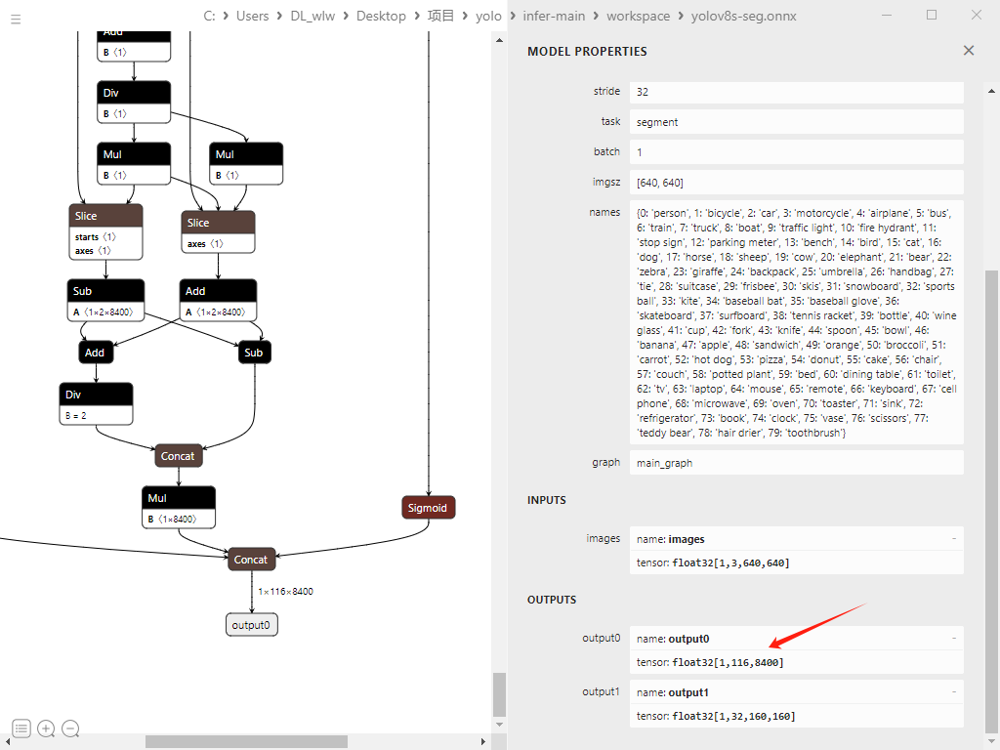

# Deployment of yolov8-seg(C++ TensorRT)
- Easily implement producer-consumer models for various tasks and perform high-performance inference
- No complex packaging, no coupling!

# For the Yolo-Demo
- YoloV8-Segment is supported
- 🚀 Cuda kernel Detect-BBox-decoding
- 🚀 Cuda kernel Segmant-Mask-decoding 

# Yolov8 Network framework


# The result of bbox


# Description
- build.cu: The encapsultion of the creating TensorRT engine (FP16 or INT8)
- engine.cu: The encapsultion of the TensorRT engine
- yolo_infer.cpp: The encapsultion of the yolov8-seg inference
- yolo_trt.cpp: The encapsultion of the Memory manage of cpu and gpu

# Attention
- yolov8-seg model (80 classes) has two heads outputs: Bbox Head , Segmant head
- Bbox Head :(batchsize * 116 * 8400)
- Segmant head :(batchsize * 32 * 160 * 160)        
-
- What dimension we need is below(See Step 1):
- Bbox Head :(batchsize * 8400 * 116)
- Segmant head :(batchsize * 32 * 160 * 160) 

### Step1 Convert the Onxx model
`python v8trans.py yolov8s-seg.onnx`

- yolov8s-seg.onnx convert before


- yolov8s-seg.onnx convert after


### Step2 Compile the project
`cmake -S . -B build`
### Step3 Build the project
`cmake --build build`
### Step4: Convert engine model, 
```bash
./build/build --onnx_file=yolov8s_seg.onnx
```
### Step5: Yolov8-seg inference
```bash
./build/yolov8_seg --yolov8 weights/yolov8s_seg.engine --vid_dir videos/
```

# Reference
- [💡Tutorial: 1. C++ TensorRT High-performance deployments(恩培计算机视觉)](https://enpeicv.com/)
- [💕Video: 2. Instance segmentation and detection of YoloV8](https://www.bilibili.com/video/BV1SY4y1C7E2)
- [🌻github_repo: TensorRT_Pro](https://github.com/shouxieai/tensorRT_Pro)

